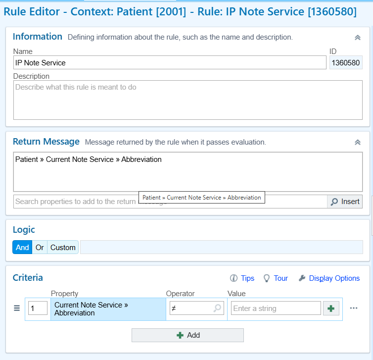

# $ZCONVERT

[IRIS Objectscript Reference](https://docs.intersystems.com/irislatest/csp/docbook/DocBook.UI.Page.cls?KEY=RCOS_fzconvert)

Step 1: Create one rule with the output that we want to change the case

*

    <figure><figcaption></figcaption></figure>

Step 2: Create Custom Property under the Same Context

* Name = C\_Capitalize String for CER Rule IP Note Service
* Lookup Type
  * Free Cache Function
  * &#x20;$zconvert(\$$getMessage^S2LPP3(1360580,,0,id,dat),""U"")
  * U and T are capitalize
  * L = lowercase
  * S and W are Capitalize First Letter in Word
* Date Type = String
* Downside: The rule will be hardcoded into the function

<figure><figcaption></figcaption></figure>

Step 3: Create Another Rule

* Add C\_Capitalize String for CER Rule as property
* Output is the Property

<figure><figcaption></figcaption></figure>

Step 4:

* Insert CERMSG in the place you want

<figure><figcaption></figcaption></figure>
