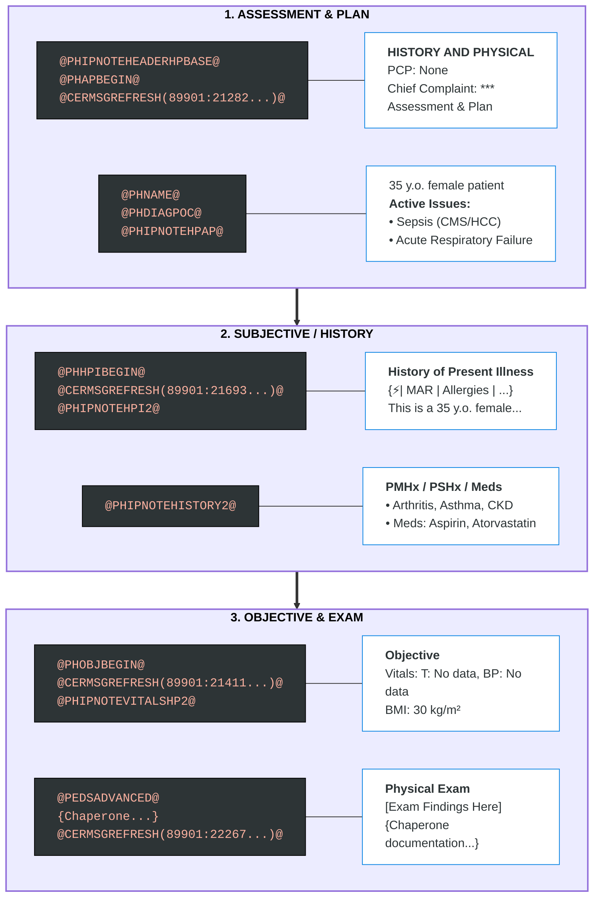

# 🩺 PH Standard Notes

Welcome to the Documentation Build Guide. Use the links below to navigate through the standard note structures:

* [**General Build Design**](./general-build-design.md) – Overarching principles for note construction.
* [**H&P (History & Physical)**](./h-and-p/) – Initial admission and comprehensive assessment templates.
* [**Consult**](./consult/) – Specialist-specific evaluation and recommendation notes.
* [**Progress Note**](./progress-note/) – Daily rounding and interval updates.
* [**Discharge Summary**](./discharge-summary/) – Hospital course transitions and follow-up planning.

