# 🩺 PH Standard Notes

Welcome to the Documentation Build Guide. Use the links below to navigate through the standard note structures:

* [**General Build Design**](./general-build-design.md) – Overarching principles for note construction.
* [**H&P (History & Physical)**](./h-and-p/) – Initial admission and comprehensive assessment templates.
* [**Consult**](./consult/) – Specialist-specific evaluation and recommendation notes.
* [**Progress Note**](./progress-note/) – Daily rounding and interval updates.
* [**Discharge Summary**](./discharge-summary/) – Hospital course transitions and follow-up planning.

```mermaid
graph TD
    %% Global Styling
    classDef section fill:#ececff,stroke:#9370db,stroke-width:2px,color:#000,font-weight:bold
    classDef codeNode fill:#2d3436,stroke:#000,color:#fab1a0,font-family:monospace,text-align:left
    classDef exampleNode fill:#ffffff,stroke:#0984e3,color:#2d3436,text-align:left

    %% HEADER & ASSESSMENT
    subgraph S1 ["1. ASSESSMENT & PLAN"]
        direction LR
        A_Code["@PHIPNOTEHEADERHPBASE@<br/>@PHAPBEGIN@<br/>@CERMSGREFRESH(89901:21282...)@"]
        A_Ex["<b>HISTORY AND PHYSICAL</b><br/>PCP: None<br/>Chief Complaint: ***<br/>Assessment & Plan"]
        
        B_Code["@PHNAME@<br/>@PHDIAGPOC@<br/>@PHIPNOTEHPAP@"]
        B_Ex["35 y.o. female patient<br/><b>Active Issues:</b><br/>• Sepsis (CMS/HCC)<br/>• Acute Respiratory Failure"]
        
        A_Code --- A_Ex
        B_Code --- B_Ex
    end

    %% SUBJECTIVE / HISTORY
    subgraph S2 ["2. SUBJECTIVE / HISTORY"]
        direction LR
        C_Code["@PHHPIBEGIN@<br/>@CERMSGREFRESH(89901:21693...)@<br/>@PHIPNOTEHPI2@"]
        C_Ex["<b>History of Present Illness</b><br/>{⚡| MAR | Allergies | ...}<br/>This is a 35 y.o. female..."]
        
        D_Code["@PHIPNOTEHISTORY2@"]
        D_Ex["<b>PMHx / PSHx / Meds</b><br/>• Arthritis, Asthma, CKD<br/>• Meds: Aspirin, Atorvastatin"]
        
        C_Code --- C_Ex
        D_Code --- D_Ex
    end

    %% OBJECTIVE
    subgraph S3 ["3. OBJECTIVE & EXAM"]
        direction LR
        E_Code["@PHOBJBEGIN@<br/>@CERMSGREFRESH(89901:21411...)@<br/>@PHIPNOTEVITALSHP2@"]
        E_Ex["<b>Objective</b><br/>Vitals: T: No data, BP: No data<br/>BMI: 30 kg/m²"]
        
        F_Code["@PEDSADVANCED@<br/>{Chaperone...}<br/>@CERMSGREFRESH(89901:22267...)@"]
        F_Ex["<b>Physical Exam</b><br/>[Exam Findings Here]<br/>{Chaperone documentation...}"]
        
        E_Code --- E_Ex
        F_Code --- F_Ex
    end

    %% Section Flow
    S1 ==> S2 ==> S3

    %% Applying Classes
    class S1,S2,S3 section
    class A_Code,B_Code,C_Code,D_Code,E_Code,F_Code codeNode
    class A_Ex,B_Ex,C_Ex,D_Ex,E_Ex,F_Ex exampleNode
```

