# General Build Design

At the most, 3 layers

Top Level -> HHS/ETX -> Service Specific ETX

Sectioning Smartlinks

* Top Level

HHS\ETX

* Rules based on Service
* ETX Overrides and Default
  * Smartlink Formatting selected (Do not match formatting)
* ETX is the lowest level
  * Formatting (Bold, Spaces, Tabs)
  * Text for user
  * \*\*\*

```mermaid
flowchart LR
    %% Top Node
    A["📋 Standard Note Framework"]

    %% Labels
    L1["🔒 Top Layer: Constant Components"]
    L2["⚙️ Lower Layer: Conditional / Modular Components "]

    %% Connections
    A --> L1
    A --> L2

    %% First Layer Subgraph
    subgraph T
        B["🔗 Sectioning Smartlinks<br/>• BookMark Section<br/>• PHSUBBEGIN PHOBJBEGIN PHDISPOBEGIN PHAPBEGIN"]
        C["🩺 Physical Exam Smartblock<br/>• Needed for Macros<br/>• PEDSADVANCED"]
        D["🩺 Diagnosis <br/>• Active Issues Section <br/>• DIAGPOC "]        
        E["📑 Standard Note Organization<br/>• APSO Format"]
        G["📜 History<br/>• Smartlink Hover Bubbles <br/>• PHIPNOTEHISTORY2 <br/>• PHHISTORYBEGIN PHPMHX
PHSH PHSOCHX PHSDOH PHALL PHPTAMED"]        
    end
    L1 --> T

    %% Second Layer Subgraph
    subgraph M
        H["🧾 Header<br/>• Customizable Title<br/>• Service <br/>• Tip Texts"]
        DISP["🏥 Disposition<br/>• Tip Texts<br/>• ACP"]
        V["📊 Vitals<br/>• Speciality Specific Vitals<br/>• Change to Non RTF"]
        NAV["🧭 Navigation Bars<br/>• Quick Links<br/>• Section Jump"]
    end
    L2 --> M

    %% Gradient Styling using CSS classes
    classDef blueGradient fill:#007acc,stroke:#004080,color:#fff,stroke-width:2px;
    classDef orangeGradient fill:#ff9900,stroke:#804d00,color:#fff,stroke-width:2px;
    classDef greenGradient fill:#66cc00,stroke:#336600,color:#fff,stroke-width:2px;
    classDef redGradient fill:#cc3333,stroke:#661a1a,color:#fff,stroke-width:2px;
    classDef purpleGradient fill:#3333cc,stroke:#1a1a66,color:#fff,stroke-width:2px;
    classDef brownGradient fill:#cc6600,stroke:#663300,color:#fff,stroke-width:2px;

    %% Apply classes
    class B blueGradient;
    class C orangeGradient;
    class D greenGradient;
    class H greenGradient;
    class DISP redGradient;
    class V purpleGradient;
    class NAV brownGradient;
  

```

